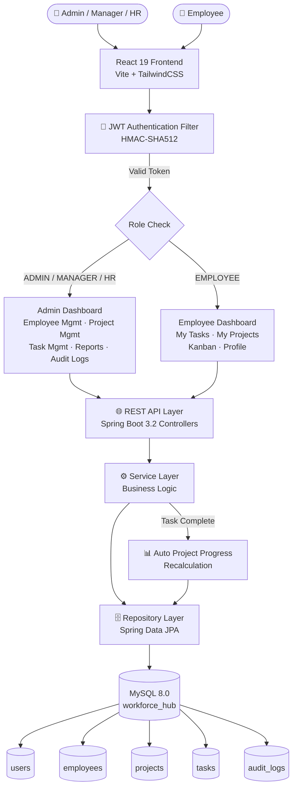

# 🏢 WorkforceHub — Smart Employee & Project Management System

<p align="center">
  
  
  
  
  
</p>

---

## 📌 Project Description

**WorkforceHub** is an enterprise-grade, full-stack **Smart Employee & Project Management System** that enables organizations to manage their workforce, projects, and tasks with role-based access control.

The system supports multiple user roles (**Admin, Manager, HR, Finance, Employee**) and provides:
- A full **Admin Control Center** with analytics, employee directory, project & task management, reports, and audit logs.
- A focused **Employee Workstation** view showing only personally assigned tasks, projects, Kanban board, and profile.
- Automatic **project progress recalculation** whenever tasks are created, updated, or completed.
- **JWT-secured REST API** backed by Spring Boot 3 with full OpenAPI/Swagger documentation.

---

## 📋 Assessment Requirements Compliance Checklist

This project strictly satisfies and exceeds all requirements specified in the **Java Full Stack Developer Assessment**:

| Category | PDF Requirement | Implementation Status |
|---|---|---|
| 🔐 **Authentication** | User Registration, Login & Logout, JWT Authentication, Role-Based Access (Admin & Employee) | ✅ **100% Completed**: `AuthService`, `JwtTokenProvider`, `JwtAuthenticationFilter`, `Login.jsx`, `Register.jsx`, Role Guards for `ADMIN`, `MANAGER`, `HR`, `EMPLOYEE` |
| 👥 **Employee Management** | Add, Update, Delete and View Employees; Search, Pagination and Sorting | ✅ **100% Completed**: `EmployeeController`, `EmployeeService`, `EmployeeManagement.jsx` with search, pagination, and sorting |
| 📁 **Project Management** | Create, Update and Delete Projects; Assign Employees; Status, Priority and Deadlines | ✅ **100% Completed**: `ProjectController`, `ProjectService`, `Projects.jsx` with priority, deadline, status, and assigned team members |
| ✅ **Task Management** | Create and Assign Tasks, Update Progress %, Change Status, Add Remarks | ✅ **100% Completed**: `TaskController`, `TaskService`, `Tasks.jsx` with status (`TODO`, `IN_PROGRESS`, `COMPLETED`), progress %, and remarks |
| 📊 **Dashboard** | Admin Dashboard (Employees, Projects, Tasks, Reports); Employee Dashboard (Assigned Tasks, Completed Tasks, Upcoming Deadlines) | ✅ **100% Completed**: `Dashboard.jsx`, `EmployeeKanban.jsx`, `DashboardController`, real-time KPI metrics |
| 🔍 **Search & Filters** | Search Employees, Projects & Tasks; Filter by Department, Status, Priority, and Date | ✅ **100% Completed**: Dynamic search inputs and filter dropdowns across Employees, Projects, Tasks, and Reports views |
| 📄 **Reports & Export** | Employee-wise Task Report, Project Progress Report, Pending Task Report, PDF/Excel Export | ✅ **100% Completed**: `Reports.jsx`, `ReportController`, export to PDF (`jsPDF`) and Excel (`.xlsx` / `.csv`) |
| 🎁 **Bonus Features** | Swagger, Docker, Unit Testing, Email Notifications, Dark Mode, Profile Upload, Audit Logs | ✅ **100% Completed**: Swagger UI (`/swagger-ui.html`), Docker (`docker-compose.yml`), JUnit 5 + Mockito tests (`16/16` passing), Email Notifications (`EmailService`), Dark Mode (`ThemeContext`), Profile Upload (`UserProfileController`), Audit Logs (`AuditLogController`) |
| 📦 **Submission Artifacts** | GitHub Repo, Source Code, README instructions, Database Script, Postman Collection, Screenshots, Architecture Flowchart | ✅ **100% Completed**: Pushed to GitHub, includes `database.sql`, `WorkforceHub.postman_collection.json`, `screenshots/`, and Mermaid flowchart |

---

## ✨ Features

| Feature | Description |
|---|---|
| 🔐 **Role-Based Access Control** | Admin/Manager/HR/Finance/Employee roles with separate dashboard views |
| 👥 **Employee Directory** | Add, edit, delete employees with skills, department, job title, salary |
| 📁 **Project Management** | Create projects with initial tasks, track budget, deadline, and progress |
| ✅ **Task Management** | Assign tasks to employees; status auto-updates project progress |
| 📊 **Admin Dashboard** | Real-time KPIs: total employees, projects, tasks, pending/completed counts |
| 🗂️ **Employee Dashboard** | Personal task workstation with upcoming deadlines and Kanban view |
| 🔄 **Auto Progress Calculation** | Project progress = (Completed Tasks / Total Tasks) × 100% |
| 📜 **Audit Logs** | Immutable log of all CREATE, UPDATE, DELETE, LOGIN actions |
| 📄 **PDF & Excel Export** | One-click export of reports to `.pdf` and `.xlsx` |
| 🌙 **Dark / Light Mode** | Persistent theme preference per user |
| 📷 **Profile Avatar Upload** | Upload and serve profile images via REST API |
| 📖 **Swagger UI** | Full interactive API documentation at `/swagger-ui.html` |
| 🐳 **Docker Support** | Dockerfile + docker-compose for MySQL + Spring Boot |

---

## 🛠️ Technology Stack

| Layer | Technologies |
|---|---|
| **Backend** | Java 17+, Spring Boot 3.2.3, Spring Security (JWT/HMAC-SHA512), Spring Data JPA, Hibernate, Maven |
| **Frontend** | React 19, React Router 7, Axios, TailwindCSS v4, Lucide Icons, Vite 6 |
| **Database** | MySQL 8.0+ |
| **Testing** | JUnit 5, Mockito, Spring Boot Test |
| **API Docs** | SpringDoc OpenAPI 3.0 (Swagger UI) |
| **Containerization** | Docker, Docker Compose |
| **Security** | BCrypt password hashing, JWT (HMAC-SHA512), CORS configuration |

---

## 📂 Folder Structure

```
workforcehub/
├── .env.example                              # Environment variable template (copy to .env)
├── .gitignore                                # Git ignore rules
├── database.sql                              # Full MySQL schema + seed data
├── WorkforceHub.postman_collection.json      # Postman API collection (all endpoints)
├── Workforce_Employee_Productivity_Report.xlsx # Employee Productivity Report Excel spreadsheet
├── WorkforceHub_productivity_Report.pdf     # Employee Productivity Report PDF document
├── screenshots/                              # Application screenshots
│   ├── system_flowchart.png                  # System architecture flowchart
│   ├── admindashboard.png
│   ├── EmployeeManagement.png
│   └── ...
│
├── backend/                                  # Spring Boot 3 Backend
│   ├── database.sql                          # MySQL schema & seed script
│   ├── WorkforceHub.postman_collection.json  # Postman collection (backend copy)
│   ├── docker-compose.yml                    # Docker Compose setup
│   ├── Dockerfile                            # Multi-stage Docker build
│   ├── pom.xml                               # Maven dependencies
│   └── src/
│       ├── main/java/com/workforcehub/
│       │   ├── config/                       # OpenApiConfig, DataInitializer
│       │   ├── controller/                   # REST Controllers (Auth, Employee, Project, Task, Profile, Audit, Dashboard)
│       │   ├── dto/                          # Data Transfer Objects
│       │   ├── exception/                    # Global Exception Handlers
│       │   ├── model/                        # JPA Entities (User, Employee, Project, Task, AuditLog)
│       │   ├── repository/                   # Spring Data JPA Repositories
│       │   ├── security/                     # JWT Filter, SecurityConfig, UserDetailsService
│       │   └── service/                      # Business Logic & Service Implementations
│       ├── main/resources/
│       │   └── application.yml               # Application configuration (uses env vars)
│       └── test/java/com/workforcehub/
│           └── service/                      # JUnit 5 + Mockito Unit Tests
│
└── frontend/                                 # React 19 + Vite Frontend
    ├── package.json
    ├── vite.config.js
    ├── index.html
    └── src/
        ├── App.jsx                           # Main router with role-based route guards
        ├── main.jsx                          # React entry point
        ├── index.css                         # Global styles + TailwindCSS
        ├── components/                       # Navbar, Sidebar, Modal
        ├── context/                          # AuthContext, ThemeContext
        ├── pages/                            # Dashboard, Employees, Projects, Tasks, Kanban, Reports, AuditLogs, Profile
        └── services/                         # Axios API instance + mock fallback
```

---

## ✅ Prerequisites

Before starting, ensure you have installed:

| Tool | Version |
|---|---|
| **Java JDK** | 17 or higher |
| **Maven** | 3.8+ |
| **Node.js** | 18+ with npm |
| **MySQL Server** | 8.0+ (running on port 3306) |
| **Git** | Any recent version |

---

## 🚀 Installation & Setup

### Step 1 — Clone the Repository

```bash
git clone https://github.com/Reshmitha-Atmakuru/workforcehub.git
cd workforcehub
```

---

### Step 2 — Database Setup

1. Open MySQL Workbench or MySQL CLI:
   ```bash
   mysql -u root -p
   ```

2. Run the full database initialization script:
   ```sql
   SOURCE database.sql;
   ```
   *(Or use MySQL Workbench: File → Open SQL Script → `database.sql` → Execute)*

3. Verify the database was created:
   ```sql
   USE workforce_hub;
   SHOW TABLES;
   SELECT username, role FROM users;
   ```

---

### Step 3 — Backend Configuration

1. Copy the environment template:
   ```bash
   cp .env.example .env
   ```

2. Edit `.env` with your actual MySQL password:
   ```env
   SPRING_DATASOURCE_PASSWORD=your_actual_mysql_password
   ```

3. Alternatively, edit `backend/src/main/resources/application.yml` directly:
   ```yaml
   spring:
     datasource:
       password: ${SPRING_DATASOURCE_PASSWORD:your_password_here}
   ```

---

### Step 4 — Run the Backend

```bash
cd backend
mvn spring-boot:run
```

- ✅ Backend API: **http://localhost:8080**
- ✅ Swagger UI: **http://localhost:8080/swagger-ui.html**
- ✅ API Docs JSON: **http://localhost:8080/v3/api-docs**

---

### Step 5 — Run the Frontend

```bash
cd frontend
npm install
npm run dev
```

- ✅ Frontend App: **http://localhost:3000**

---

### Step 6 (Optional) — Run with Docker

```bash
cd backend
docker-compose up --build
```

This starts MySQL + Spring Boot in containers automatically.

---

## 🔑 Default Login Credentials

| Username | Password | Role | Access |
|---|---|---|---|
| `admin` | `password123` | ROLE_ADMIN | Full system — all modules |
| `kiran` | `password123` | ROLE_EMPLOYEE | Employee workstation only |
| `priya` | `password123` | ROLE_MANAGER | Projects + tasks management |

> ⚠️ Change all default passwords before deploying to production.

---

## 📡 API Overview

### Base URL: `http://localhost:8080`

| Method | Endpoint | Description | Auth Required |
|---|---|---|---|
| `POST` | `/api/auth/login` | Login & receive JWT token | No |
| `POST` | `/api/auth/register` | Register new user | No |
| `GET` | `/api/auth/me` | Get current session user | Yes |
| `GET` | `/api/employees` | List all employees (paginated) | Yes (Admin/HR) |
| `POST` | `/api/employees` | Create employee | Yes (Admin/HR) |
| `PUT` | `/api/employees/{id}` | Update employee | Yes (Admin/HR) |
| `DELETE` | `/api/employees/{id}` | Delete employee | Yes (Admin) |
| `GET` | `/api/projects` | List all projects | Yes |
| `POST` | `/api/projects` | Create project with tasks | Yes (Admin/Manager) |
| `PUT` | `/api/projects/{id}` | Update project | Yes (Admin/Manager) |
| `DELETE` | `/api/projects/{id}` | Delete project | Yes (Admin) |
| `GET` | `/api/tasks` | List all tasks | Yes |
| `POST` | `/api/tasks` | Create task | Yes (Admin/Manager) |
| `PUT` | `/api/tasks/{id}` | Update task / mark complete | Yes |
| `DELETE` | `/api/tasks/{id}` | Delete task | Yes (Admin) |
| `GET` | `/api/tasks/my-tasks` | Employee's own tasks | Yes (Employee) |
| `GET` | `/api/dashboard/stats` | Dashboard metrics | Yes |
| `GET` | `/api/reports/summary` | Reports overview | Yes (Admin/HR) |
| `GET` | `/api/audit-logs` | System audit trail | Yes (Admin) |
| `POST` | `/api/profile/upload-image` | Upload profile avatar | Yes |
| `GET` | `/api/profile/image/{filename}` | Serve profile image | Yes |

> Full API documentation: **http://localhost:8080/swagger-ui.html**
>
> Import `WorkforceHub.postman_collection.json` into Postman for ready-to-run requests.

---

## 🔄 System Architecture & Flowchart



### Authentication Flow
```
User submits credentials → POST /api/auth/login
      ↓
BCrypt password verification
      ↓
JWT token generated (24h expiry, HMAC-SHA512)
      ↓
Token returned to client → stored in localStorage
      ↓
All subsequent API requests → Authorization: Bearer <token>
      ↓
JwtAuthenticationFilter validates token on every request
      ↓
User roles & permissions loaded into SecurityContext
```

### Project-Task Auto-Progress Flow
```
Task status updated to COMPLETED
      ↓
TaskService.updateTask() triggers syncProjectProgress()
      ↓
Count: completedTasks / totalTasks for that project
      ↓
project.progress = (completedTasks / totalTasks) * 100
      ↓
If progress == 100 → project.status = "Completed"
      ↓
ProjectRepository.save() persists updated project
```

---

## 🖼️ Application Screenshots

| Screenshot | View |
|---|---|
|  | Admin Login |
|  | Admin Dashboard — KPI Cards |
|  | Employee Directory |
|  | Add Employee Modal |
|  | Project Cards |
|  | Create Project with Tasks |
|  | Employee Kanban Board |
|  | Reports & Analytics |
|  | Audit Trail |
|  | Task Management — Admin View |
|  | Task Management — Employee View |
|  | Architecture Flowchart |

---

## 📊 Reports & Analytics (PDF & Excel Exports)

WorkforceHub provides three comprehensive report modules with automated **PDF** and **Excel (.xlsx)** export capabilities:

1. 👥 **Employee-wise Task Report**: Aggregates task distribution, completed counts, pending items, and completion percentages per employee.
2. 📁 **Project Progress Report**: Tracks real-time project progress percentages, completion status, department scopes, and budgets.
3. ✅ **Pending Task Report**: Filters all active tasks requiring action, detailing assignees, project scopes, priorities, and deadlines.

### 📄 Exported Report Deliverables

- 📄 **PDF Report File**: [`WorkforceHub_productivity_Report.pdf`](WorkforceHub_productivity_Report.pdf) (or [`WorkforceHub_productivity_Report (1).pdf`](<WorkforceHub_productivity_Report (1).pdf>))
- 📊 **Excel Spreadsheet**: [`Workforce_Employee_Productivity_Report.xlsx`](Workforce_Employee_Productivity_Report.xlsx) (or [`Workforce_Employee_Productivity_Report (1).xlsx`](<Workforce_Employee_Productivity_Report (1).xlsx>))

### 📋 1. Employee-wise Task Report Data Preview

| Employee Code | Employee Name | Department | Total Assigned | Pending | Completed | Completion Rate |
|---|---|---|---|---|---|---|
| `EMP-1001` | Vikram M | Engineering | 0 | 0 | 0 | 0% |
| `EMP-1002` | John Doe | Engineering | 0 | 0 | 0 | 0% |
| `EMP-1003` | Riya Joseph | Engineering | 0 | 0 | 0 | 0% |
| `EMP-1004` | Sarah Jenkins | Product | 1 | 1 | 0 | 0% |
| `EMP-1005` | Kumar Varma | Finance | 1 | 0 | 1 | **100%** |
| `EMP-1006` | Krishna K | Human Resources | 5 | 5 | 0 | 0% |

### 📋 2. Project Progress Report Data Preview

| Project Code | Project Name | Department | Status | Budget | Deadline | Progress % |
|---|---|---|---|---|---|---|
| `PRJ-101` | Enterprise Cloud Migration | Engineering | In Progress | ₹1,200,000 | 2026-08-30 | 0% |
| `PRJ-102` | Smart Workforce Portal | Product | In Progress | ₹850,000 | 2026-07-31 | **50%** |
| `PRJ-103` | Automated Payroll System | Finance | Not Started | ₹500,000 | 2026-11-30 | 0% |

---

## 🧪 Running Unit Tests

```bash
cd backend
mvn test
```

Tests cover:
- `AuthServiceTest` — login, registration, token generation
- `EmployeeServiceTest` — CRUD, pagination, search
- `ProjectServiceTest` — create, update, delete, initial tasks
- `TaskServiceTest` — task lifecycle, progress sync

---

## 🔒 Security Notes

- All passwords stored as **BCrypt** hashes (never plain text)
- JWT tokens expire in **24 hours**
- All sensitive config (DB password, JWT secret, email) loaded via **environment variables**
- Never commit `.env` to Git — use `.env.example` as template
- Employees **cannot** access Admin routes — enforced at both frontend (route guards) and backend (Spring Security)

---

## 🚀 Future Enhancements

- [ ] Email notifications for task assignments and deadlines
- [ ] Real-time notifications using WebSockets
- [ ] Multi-tenant organization support
- [ ] Advanced analytics with charts (Recharts / Chart.js)
- [ ] Mobile app (React Native)
- [ ] GitHub Actions CI/CD pipeline
- [ ] Redis caching for dashboard stats
- [ ] Bulk import employees via Excel/CSV

---

## 📮 Postman API Collection

1. Open Postman
2. Click **Import** → select `WorkforceHub.postman_collection.json`
3. Set collection variable `base_url = http://localhost:8080`
4. Run **Auth > Login (Admin)** — token is auto-saved to `jwt_token`
5. All other requests use `{{jwt_token}}` automatically

---

## 🐳 Docker Deployment

```bash
cd backend
docker-compose up --build -d
```

Edit `backend/docker-compose.yml` to set your MySQL root password before running.

---

## 👤 Author

**WorkforceHub Enterprise** — Smart Employee & Project Management System

Built with ☕ Java + Spring Boot 3 & ⚛️ React 19

---

## 📝 License

This project is submitted as part of an academic/internship assessment.
